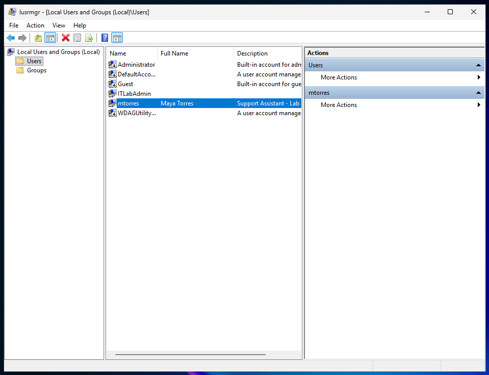
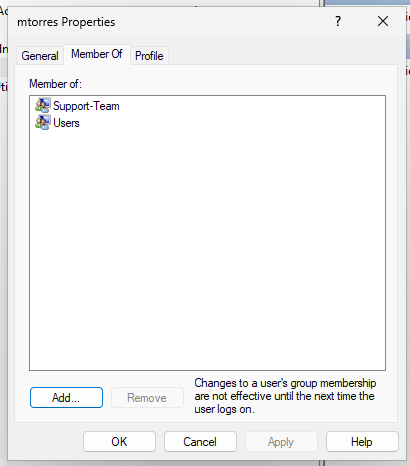
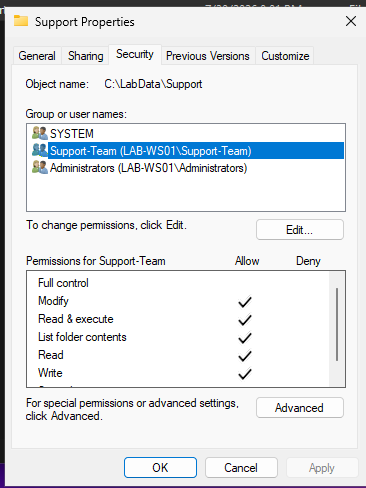
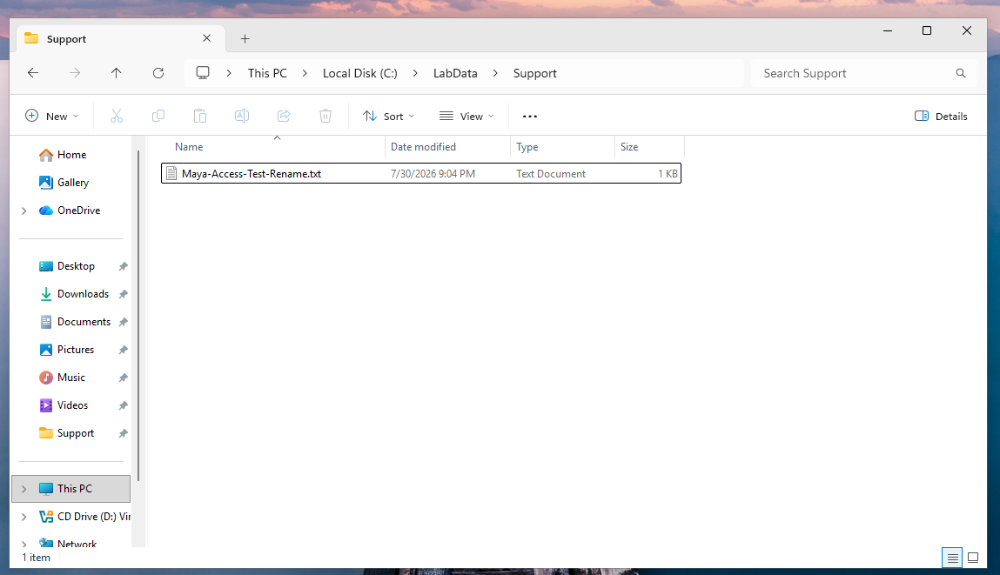
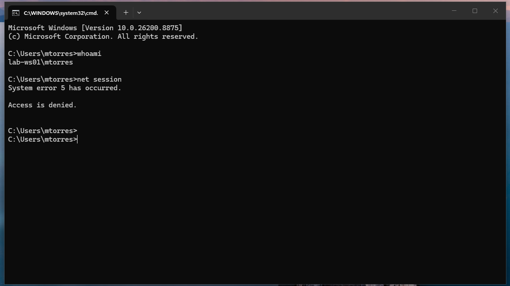

# LAB-02 — Local Users, Groups, and Folder Permissions

## Objective

Provision a standard local user account, assign access through group membership, configure NTFS folder permissions, and verify that the user can work with designated files without receiving administrative privileges.

## Scenario

A new support assistant, Maya Torres, requires a local account on workstation `LAB-WS01`.

The user must be able to access and modify files inside:

`C:\LabData\Support`

Access must be granted through the local group `Support-Team`, rather than assigning permissions directly to the user.

The account must remain a standard user without administrative privileges.

## Lab Environment

- Workstation: `LAB-WS01`
- Operating system: Windows 11 Enterprise Evaluation
- Account created: `mtorres`
- Display name: Maya Torres
- Local group: `Support-Team`
- Folder: `C:\LabData\Support`
- Permission assigned: `Modify`
- Related ticket: `SR-002 — Provision Local User and Folder Access`

## Skills Practiced

- Creating local Windows accounts
- Distinguishing standard users from administrators
- Creating and managing local groups
- Assigning access through group membership
- Reviewing inherited NTFS permissions
- Applying the principle of least privilege
- Testing file and administrative access
- Documenting a service request in GitHub

## Procedure

### 1. Create the Local User

Opened Local Users and Groups by running `lusrmgr.msc`.

Created the following local account:

- Username: `mtorres`
- Full name: Maya Torres
- Description: Support Assistant - Lab account
- Account type: Standard user

The account was configured to require a password change at the first sign-in.

### 2. Create the Local Group

Created the local group `Support-Team` with the description:

`Local group for support team folder access`

Added `mtorres` as a member of `Support-Team`.

### 3. Create the Support Folder

Created the following folder:

`C:\LabData\Support`

### 4. Review Existing NTFS Permissions

Reviewed the folder's Security properties.

The folder initially inherited permissions for:

- `Authenticated Users`
- `Users`
- `SYSTEM`
- `Administrators`

The `Authenticated Users` and `Users` entries allowed users to modify the folder independently of membership in `Support-Team`.

### 5. Correct the Folder Permissions

Disabled permission inheritance and converted the inherited permissions into explicit permissions.

Removed:

- `Authenticated Users`
- `Users`

Retained:

- `SYSTEM`
- `Administrators`

Added `Support-Team` and granted the `Modify` permission.

`Full control` was not granted.

### 6. Sign In as the New User

Signed out of the administrator account and signed in as Maya Torres.

The user successfully changed the temporary password during the first sign-in.

## Validation

### Local Account Created

The local account `mtorres` was created for Maya Torres.

### Group Membership

The account belongs to `Users` and `Support-Team`, but not to `Administrators`.

### NTFS Permissions

The `Support-Team` group was granted `Modify` permission on `C:\LabData\Support`.

`Full control` was not granted.

### File Access Test

The user successfully created, edited, renamed, and deleted files inside the Support folder.

### Administrative Access Test

The `whoami` command confirmed the active account as:

`lab-ws01\mtorres`

The `net session` command returned:

`System error 5 has occurred. Access is denied.`

This confirmed that the account did not have elevated administrative privileges.

## Troubleshooting

### Initial Sign-In Attempt

The first sign-in attempt did not accept the temporary credentials.

The account name and password were reviewed, and the sign-in was attempted again successfully. Windows then required the user to create a new password.

This reinforced the importance of verifying the selected account and credentials before resetting or recreating an account.

### Permission Application Warning

While changing the folder permissions, Windows displayed the following message:

`Failed to enumerate objects in the container. Access is denied.`

The operation was allowed to continue, and the final folder permissions were reviewed afterward.

The completed configuration correctly showed:

- `SYSTEM`
- `Administrators`
- `Support-Team` with `Modify`

The unnecessary `Authenticated Users` and `Users` entries were no longer present.

This demonstrated that an error message should be investigated and that the final configuration must be validated before determining whether an operation succeeded or failed.

## Lessons Learned

- Standard users can access authorized resources without receiving administrative privileges.
- Permissions are easier to manage when assigned to groups instead of individual users.
- Inherited permissions must be reviewed because they can provide access through an unintended path.
- The `Modify` permission allows users to create, edit, rename, and delete files without granting `Full control`.
- NTFS permissions control access to files and folders stored on a Windows file system.
- The principle of least privilege means granting only the permissions required for a user’s role.
- Access validation should test both permitted actions and actions that must remain restricted.
- Error messages should be documented together with the checks used to confirm the final result.

## Conclusion

The objectives of LAB-02 were completed successfully.

The local account `mtorres` was configured as a standard user and received access to `C:\LabData\Support` through membership in `Support-Team`.

The user successfully created, edited, renamed, and deleted files inside the designated folder. Administrative access was correctly denied.

This lab demonstrated practical Windows account administration, local group management, NTFS permission configuration, least-privilege access, technical validation, and service-request documentation.
