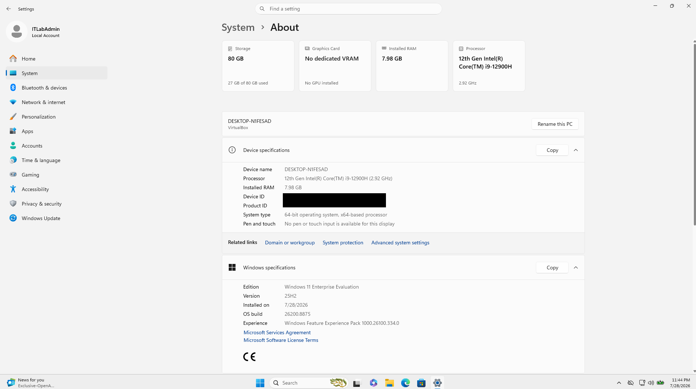
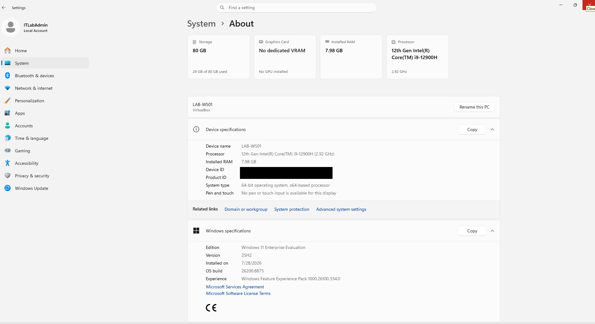
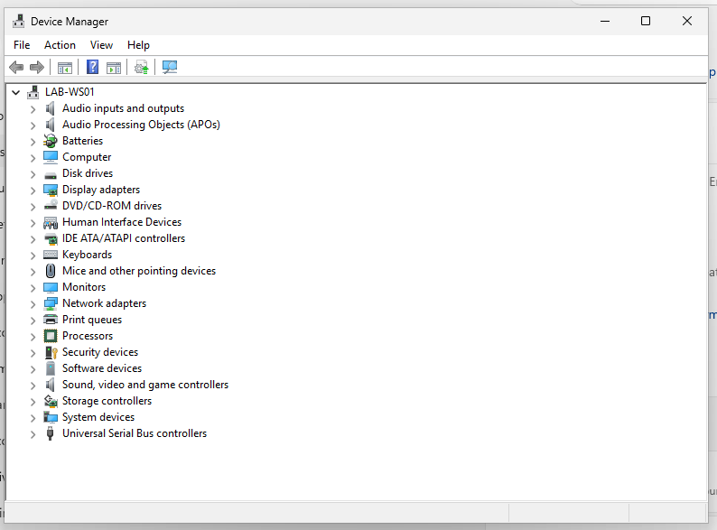

# LAB-01 Evidence

Visual evidence for **LAB-01 — Windows Workstation Inventory**.

Sensitive identifiers were removed before publication.

## 1. Original Device Name

The workstation initially used an automatically generated Windows device name.

## 2. Final Workstation Baseline

The workstation was renamed to `LAB-WS01` according to the established lab naming convention.

Device ID and Product ID were redacted before publication.

## 3. Device Manager Review

Device Manager showed no visible warning indicators, unknown devices, or disabled devices.

