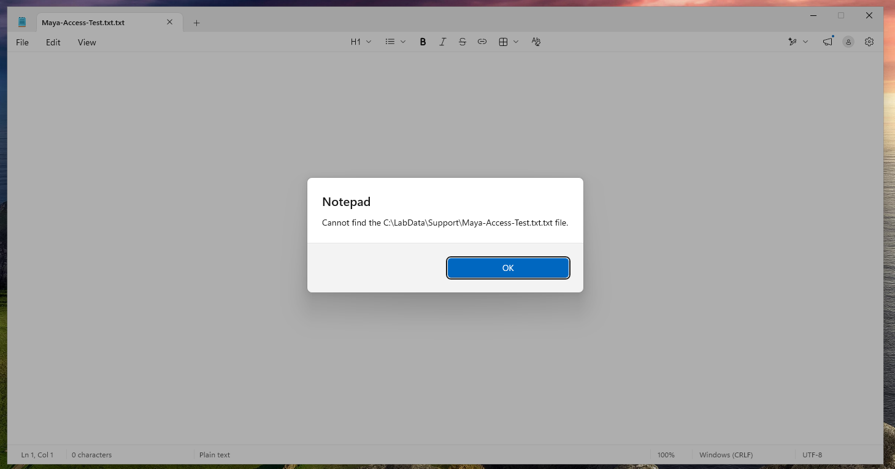
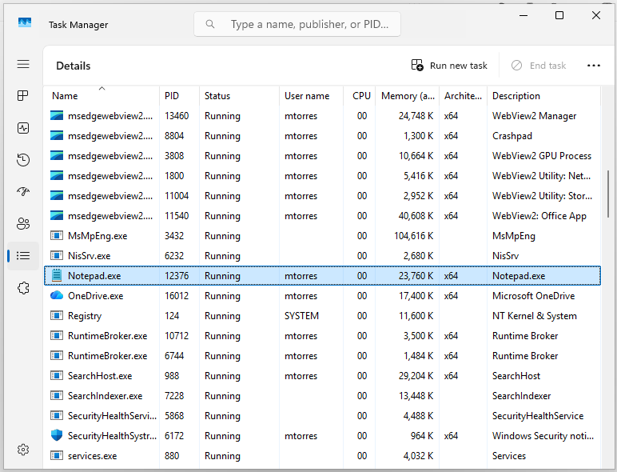
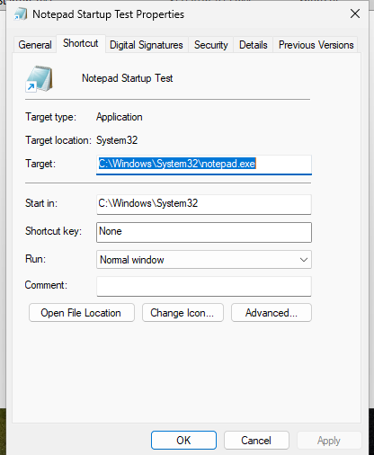
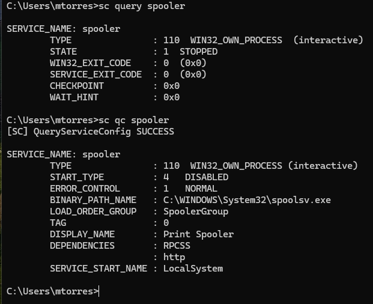
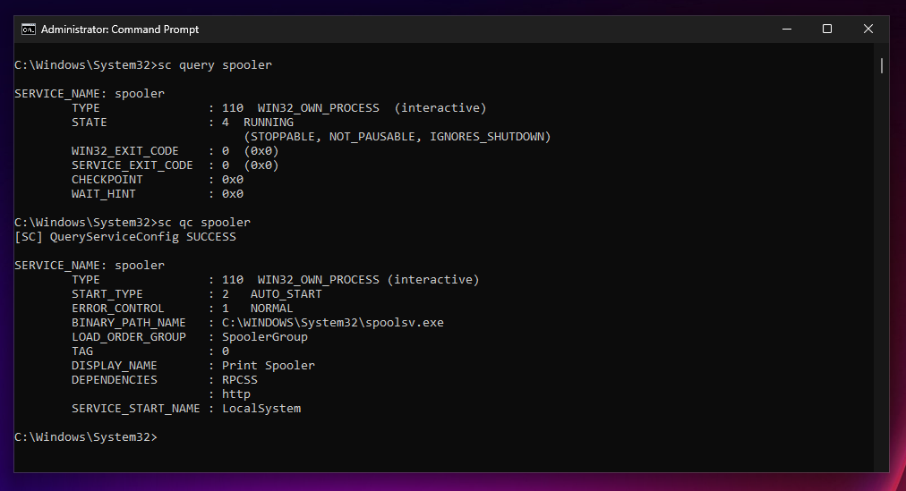
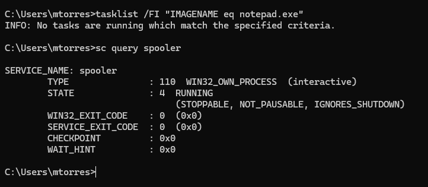

# LAB-03 Evidence

Visual evidence for **LAB-03 — Windows Processes, Services, and Startup Troubleshooting**.

The account and employee information used in this lab are fictitious. Passwords and other credentials were not included in the public documentation.

## 1. Automatic Notepad Launch Reproduced

After signing in as `mtorres`, Notepad opened automatically without being launched manually.

This confirmed the first reported symptom.

## 2. Notepad Process Identified

Task Manager identified the running process as `Notepad.exe`.

The process was running under the `mtorres` account with PID `12376`.

## 3. Startup Shortcut Identified

The shortcut responsible for launching Notepad was found in the current user's Startup folder.

The shortcut target was:

`C:\Windows\System32\notepad.exe`

## 4. Print Spooler Misconfiguration Confirmed

The `sc query spooler` command showed that the Print Spooler service was:

`STOPPED`

The `sc qc spooler` command showed that its startup type was:

`DISABLED`

## 5. Print Spooler Restored

The Print Spooler startup type was changed to `AUTO_START`, and the service was started successfully.

The service configuration and running state were then confirmed.

## 6. Final Validation After Restart

After restarting Windows and signing in as `mtorres`, the `tasklist` command confirmed that no `Notepad.exe` process was running.

The Print Spooler service remained in:

`STATE: 4 RUNNING`

This confirmed that both corrections persisted after the restart.

