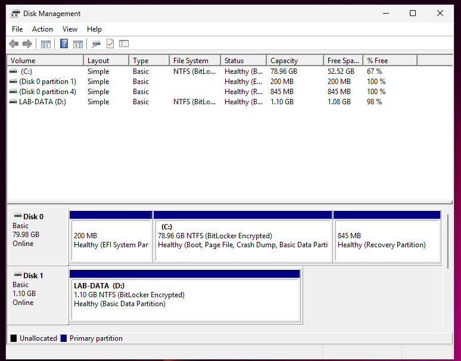
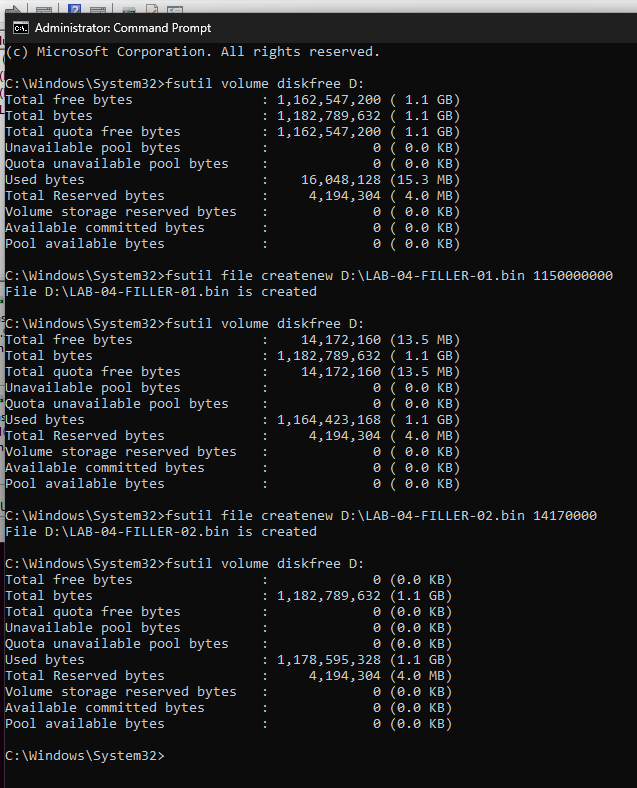
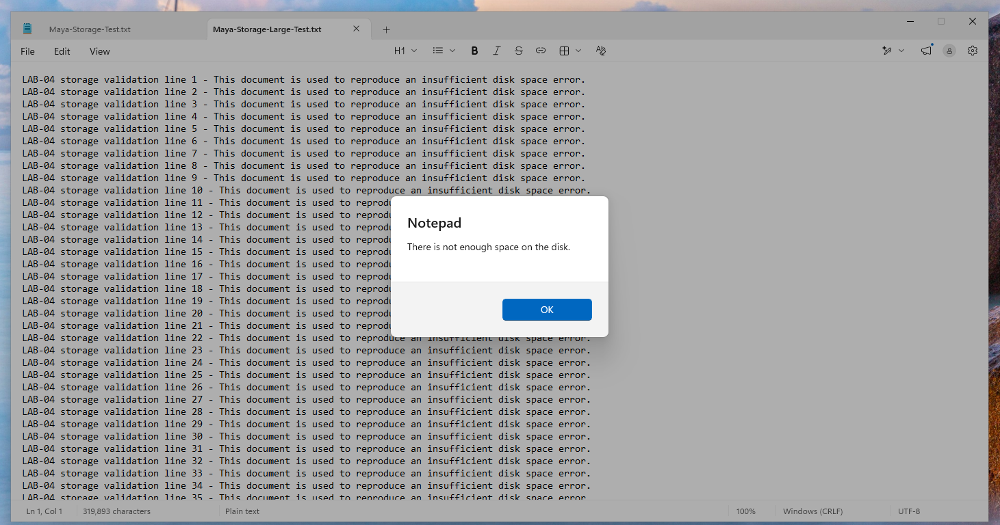
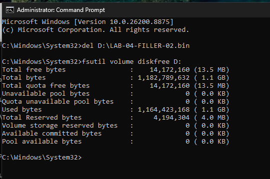
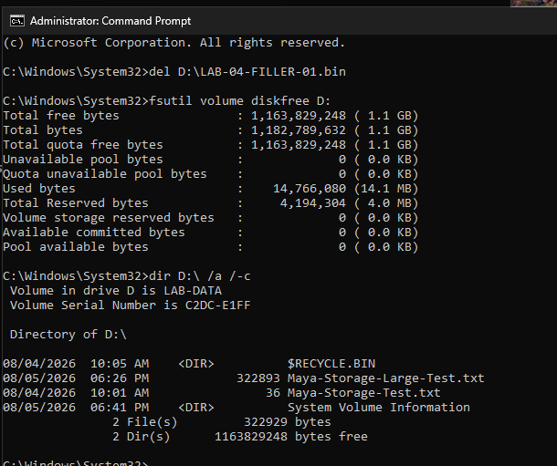
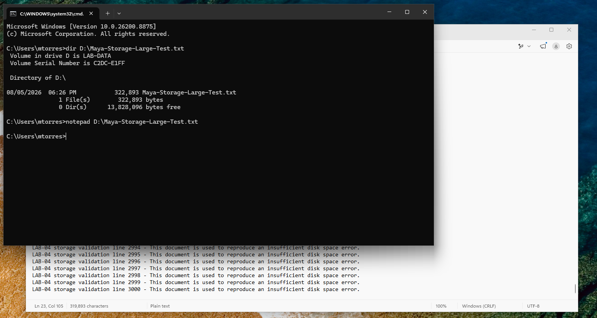

# LAB-04 Evidence

Visual evidence for **LAB-04 — Storage and Application Troubleshooting**.

The account and employee information used in this lab are fictitious. Passwords and other credentials were not included in the public documentation.

## 1. LAB-DATA Volume Created

A secondary virtual disk was initialized using GPT and configured as an NTFS volume.

The volume was assigned:

- Volume label: `LAB-DATA`
- Drive letter: `D:`
- Status: Healthy



## 2. Volume Filled to Capacity

Controlled test files were created on `D:` to reproduce an insufficient storage condition.

The `fsutil volume diskfree D:` command confirmed:

`Total free bytes: 0`

This established the storage condition required to reproduce the reported incident.



## 3. Notepad Save Failure Reproduced

A larger test document containing 3,000 lines was opened in Notepad and saved to the full `D:` volume.

Windows displayed the following error:

`There is not enough space on the disk.`

This confirmed the reported application save failure.



## 4. Controlled Filler Files Identified

The contents of `D:` were reviewed using:

```cmd
dir D:\ /a /-c
```

The investigation identified the controlled files consuming the available storage:

- `LAB-04-FILLER-01.bin`
- `LAB-04-FILLER-02.bin`

The existing user test file and Windows system directories were not removed.


## 5. Free Space Restored

The verified test file `LAB-04-FILLER-02.bin` was deleted.

The `fsutil volume diskfree D:` command confirmed that the action restored:

`14,172,160 bytes`

This provided enough available space to repeat the save operation successfully.



## 6. Final Validation After Restart

After restarting Windows and signing in as `mtorres`, the `LAB-DATA` volume remained mounted as `D:`.

The saved document:

- Remained available on the volume
- Retained its full size of `322,893` bytes
- Reopened successfully in Notepad
- Contained all 3,000 test lines

## 7. Final Storage Cleanup Validation

After completing the functional validation, the remaining controlled test file `LAB-04-FILLER-01.bin` was deleted.

The `fsutil volume diskfree D:` command confirmed:

`1,163,829,248 bytes free`

The contents of the volume were reviewed again using:

```cmd
dir D:\ /a /-c
```

The final review confirmed that:

- Both controlled filler files had been removed
- `Maya-Storage-Large-Test.txt` remained intact at `322,893` bytes
- `Maya-Storage-Test.txt` remained intact at `36` bytes
- `$RECYCLE.BIN` was preserved
- `System Volume Information` was preserved
- The volume had approximately 98% available free space

This confirmed that the test data was removed safely without deleting user files or Windows system directories.



This confirmed that the correction remained effective after the restart.


